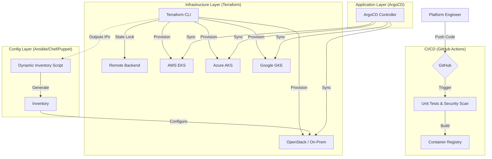

# Enterprise Hybrid-Cloud Kubernetes Platform


## 📖 Overview
The **Enterprise Kubernetes Platform** is a production-grade, holistic infrastructure solution designed to solve the complexity of managing Kubernetes across hybrid environments. It provides a unified control plane for provisioning, securing, and operating clusters on **AWS (EKS), Azure (AKS), Google Cloud (GKE), and Private Cloud (OpenStack/Bare Metal)**.

This project implements the "Golden Path" for platform engineering, enforcing strict **Infrastructure-as-Code (IaC)**, **GitOps**, and **Zero-Trust Security** principles.

## 🚀 Key Features

### 1. Multi-Cloud Infrastructure (Terraform)
- **Universal Provisioning**: Modular Terraform code to spin up clusters on any major provider.
- **State Management**: Zero-risk collaboration using remote backends (S3, Swift, Azure Blob, GCS) with state locking.
- **Hybrid Networking**: Seamless handling of VPCs, VNets, and On-Prem networking.

### 2. Configuration Management (Ansible / Chef / Puppet)
- **Flexible Hardening**: Supports multiple CM tools to manage node baselines and OS compliance.
- **Dynamic Inventory**: Custom Python automation (`ansible/scripts/generate_inventory.py`) bridges Terraform state with Ansible, eliminating manual IP management.
- **Zero-Touch Bootstrap**: Automated provisioning of worker nodes from raw OS to K8s-ready state.

### 3. GitOps Delivery (ArgoCD)
- **Declarative Operations**: The entire platform state (Monitoring, Security, Apps) is defined in Git.
- **Drift Detection**: Automatic synchronization ensures the live cluster always matches the repo.
- **Versioning**: Strict pinning of application versions (e.g., `v1.0.0`) prevents "latest tag" breakages.

### 4. Production-Grade Security (DevSecOps)
- **Policy as Code**: **Kyverno** enforces Pod Security Standards (Restricted Profile) to block privileged containers.
- **Network Segmentation**: **Istio** Service Mesh (mTLS) and "Default Deny" Network Policies.
- **Vulnerability Mgmt**: **Trivy** scans container images in the CI pipeline and via daily CronJobs in the cluster.
- **Storage Encryption**: Integration with AWS KMS, Azure Key Vault, and GCP KMS for Kubernetes Secrets.

### 5. Observability & Storage
- **Logging & Metrics**: Full **ELK Stack** (Elasticsearch, Logstash, Kibana) and **Prometheus/Grafana** integration.
- **Stateful Workloads**: CSI Drivers (AWS EBS, Cinder) and NFS support for persistent data.

## 🏗️ Architecture

The platform follows a layered architecture to decouple infrastructure from applications:



## 📚 Documentation
For detailed deep-dives into specific areas, please refer to the `docs/` directory:

- **[Technology Stack](./docs/technology-stack.md)**: A complete list of all 20+ tools and technologies used.
- **[Project Structure](./docs/project-structure.md)**: A file-by-file map of the repository layout.
- **[Architecture](./docs/architecture.md)**: System design patterns and decision logs.

## 🛠️ Getting Started

### Prerequisites
- Terraform >= 1.5.0
- Ansible >= 2.10
- AWS/Azure/GCP/OpenStack CLI configured

### Quick Deploy (AWS)
```bash
# 1. Initialize & Apply Infrastructure
cd terraform/aws-eks
terraform init
terraform apply

# 2. Configure Local Kubeconfig
aws eks update-kubeconfig --name enterprise-cluster
```

### Quick Deploy (OpenStack with Ansible)
```bash
# 1. Provision Infrastructure
cd terraform/openstack-kind
terraform init
terraform apply

# 2. Generate Inventory
cd ../../ansible
python scripts/generate_inventory.py

# 3. Bootstrap Nodes
ansible-playbook -i inventory site.yml
```

## 🛡️ License
MIT License.
