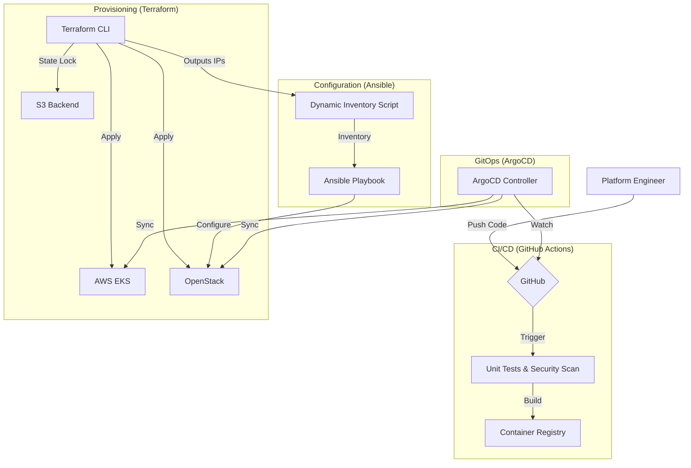

# Enterprise Hybrid-Cloud Kubernetes Platform


## 🚀 The Core Problem
In modern enterprise environments, platform teams struggle with **Infrastructure Fragmentation**. provisioning and securing Kubernetes clusters across public clouds (AWS EKS) and private data centers (OpenStack/Bare Metal) often results in:
- **Inconsistent Security Postures**: Different firewalls and policies for Cloud vs. On-Prem.
- **Operational Drift**: Manual "snowflake" configurations that break scaling.
- **Complexity Overload**: Managing state, secrets, and networking across disparate providers.

## 💡 The Solution
The **Enterprise Kubernetes Platform** is a unified, opinionated, and automated infrastructure stack that standardizes the *entire* lifecycle of Kubernetes clusters. It decouples the "What" (Platform Services) from the "Where" (AWS/OpenStack) using a strict **Infrastructure-as-Code** and **GitOps** approach.

## 🔑 Key Features

### 1. Unified Infrastructure as Code (Terraform)
- **Multi-Provider Support**: First-class modules for **AWS EKS** (Cloud-Native) and **OpenStack** (Private Cloud).
- **State Safety**: Configured with Remote Backends (**S3 + DynamoDB** for AWS, **Swift** for OpenStack) and State Locking to prevent corruption in team environments.
- **Modular Design**: Reusable modules for networking, compute, and security groups.

### 2. Intelligent Configuration Management (Ansible)
- **Dynamic Inventory Bridge**: Custom Python scripts (`ansible/scripts/generate_inventory.py`) that automatically query Terraform state to generate live Ansible inventories.
- **Zero-Touch Bootstrapping**: Automatically configures worker nodes without manual IP management.

### 3. Production-Grade Security
- **Network Hardening**:
    - **Kubernetes**: "Default Deny" Network Policies to enforce Zero Trust.
    - **Cloud**: Parameterized Security Groups to restrict SSH/API access to VPNs only.
- **Encryption**: Full envelope encryption for Kubernetes Secrets using **AWS KMS**.
- **Supply Chain Security**: Docker image scanning via **Trivy** in CI pipelines.

### 4. GitOps Delivery (ArgoCD)
- **Declarative Apps**: All platform services (Service Mesh, Ingress, Monitoring) defined in Git.
- **Stability**: Pinned application revisions (e.g., `v1.0.0`) to prevent "latest tag" outages.

## 🏗️ Architecture Overview



## 🛠️ Getting Started

### Prerequisites
- Terraform >= 1.5.0
- Ansible >= 2.10
- AWS CLI / OpenStack CLI configured

### Quick Deploy (AWS)
```bash
# 1. Initialize & Apply Infrastructure
cd terraform/aws-eks
terraform init
terraform apply

# 2. Configure Local Kubeconfig
aws eks update-kubeconfig --name enterprise-cluster
```

### Quick Deploy (OpenStack)
```bash
# 1. Provision Infrastructure
cd terraform/openstack-kind
terraform init
terraform apply

# 2. Generate Inventory
cd ../../ansible
python scripts/generate_inventory.py

# 3. Bootstrap Nodes
ansible-playbook -i inventory site.yml
```

## 🛡️ License
MIT
