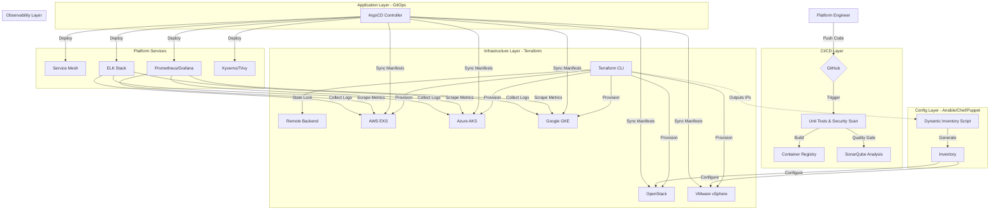

# Enterprise Hybrid-Cloud Kubernetes Platform


## 📖 Overview
The **Enterprise Kubernetes Platform** is a production-grade, holistic infrastructure solution designed to solve the complexity of managing Kubernetes across hybrid environments. It provides a unified control plane for provisioning, securing, and operating clusters on **AWS (EKS), Azure (AKS), Google Cloud (GKE), OpenStack, and VMware vSphere**.

This project implements the "Golden Path" for platform engineering, enforcing strict **Infrastructure-as-Code (IaC)**, **GitOps**, and **Zero-Trust Security** principles. It includes comprehensive automation scripts for CI/CD pipeline setup, making it production-ready out of the box.

## 🚀 Key Features

### 1. Multi-Cloud Infrastructure (Terraform)
- **Universal Provisioning**: Modular Terraform code to spin up clusters on any major provider:
  - **AWS EKS**: Fully managed Kubernetes with VPC, IAM, and KMS integration
  - **Azure AKS**: Azure Kubernetes Service with VNet and Azure Monitor
  - **GCP GKE**: Google Kubernetes Engine with Autopilot/Standard modes
  - **OpenStack**: Private cloud deployment with custom networking
  - **VMware vSphere**: On-premise virtualized infrastructure support
- **State Management**: Zero-risk collaboration using remote backends (S3, Swift, Azure Blob, GCS) with state locking
- **Hybrid Networking**: Seamless handling of VPCs, VNets, and On-Prem networking

### 2. Configuration Management (Ansible / Chef / Puppet)
- **Flexible Hardening**: Supports multiple CM tools to manage node baselines and OS compliance
- **Dynamic Inventory**: Custom Python automation (`ansible/scripts/generate_inventory.py`) bridges Terraform state with Ansible, eliminating manual IP management
- **Zero-Touch Bootstrap**: Automated provisioning of worker nodes from raw OS to K8s-ready state

### 3. GitOps Delivery (ArgoCD)
- **Declarative Operations**: The entire platform state (Monitoring, Security, Apps) is defined in Git
- **Drift Detection**: Automatic synchronization ensures the live cluster always matches the repo
- **Versioning**: Strict pinning of application versions (e.g., `v1.0.0`) prevents "latest tag" breakages

### 4. Production-Grade Security (DevSecOps)
- **Policy as Code**: **Kyverno** enforces Pod Security Standards (Restricted Profile) to block privileged containers
- **Network Segmentation**: **Istio** Service Mesh (mTLS) and "Default Deny" Network Policies
- **Vulnerability Mgmt**: **Trivy** scans container images in the CI pipeline and via daily CronJobs in the cluster
- **Storage Encryption**: Integration with AWS KMS, Azure Key Vault, and GCP KMS for Kubernetes Secrets

### 5. Observability & Monitoring
- **Logging Stack**: Full **ELK Stack** (Elasticsearch, Logstash, Kibana) for centralized log aggregation and analysis
- **Metrics & Dashboards**: **Prometheus** for metrics collection and **Grafana** for visualization
- **Stateful Workloads**: CSI Drivers (AWS EBS, Azure Disk, GCP PD, Cinder) and NFS support for persistent data

### 6. Platform Services & Components
- **Service Mesh**: Istio for traffic management, observability, and security
- **Ingress Controllers**: NGINX and Istio ingress gateways
- **Certificate Management**: cert-manager for automated TLS certificate provisioning
- **CI/CD**: Jenkins with automated pipeline configuration
- **Monitoring**: Integrated Prometheus and Grafana stacks

### 7. Automation & CI/CD Setup Scripts
The `scripts/` directory contains production-ready automation for complete CI/CD pipeline setup:
- **ECR Setup**: Automated AWS Elastic Container Registry creation and configuration
- **GitHub Integration**: Automated GitHub secrets configuration for webhooks
- **SonarQube Integration**: Code quality analysis webhook setup
- **Jenkins Configuration**: Automated Jenkins credentials and pipeline setup
- **Master Setup Script**: One-command orchestration of all setup tasks

See [scripts/README.md](./scripts/README.md) for detailed usage instructions.

## 🏗️ Architecture

The platform follows a layered architecture to decouple infrastructure from applications:



## 📁 Project Structure

```
enterprise-k8s-platform/
├── terraform/              # Infrastructure as Code for all cloud providers
│   ├── aws-eks/           # AWS EKS cluster with VPC, IAM, KMS
│   ├── azure-aks/         # Azure AKS with VNet and monitoring
│   ├── gcp-gke/           # GCP GKE Autopilot/Standard clusters
│   ├── openstack-kind/    # OpenStack private cloud deployment
│   └── vmware-kind/       # VMware vSphere on-premise clusters
│
├── kubernetes/            # Kubernetes manifests organized by purpose
│   ├── platform-services/ # Core platform components (ArgoCD, Istio, Jenkins, Monitoring)
│   ├── cluster-addons/    # Essential plugins (ingress, cert-manager, monitoring)
│   └── workloads/         # Application deployments and services
│
├── ansible/               # Configuration management for bare-metal/OpenStack
│   ├── roles/            # Reusable Ansible roles for K8s bootstrap
│   ├── scripts/          # Dynamic inventory generation from Terraform
│   └── site.yml          # Master playbook
│
├── platform/              # Platform-level abstractions and services
│   └── observability/    # Unified observability configuration
│
├── observability/         # Observability stack configurations
│   └── elk/              # Elasticsearch, Logstash, Kibana setup
│
├── security/              # Security policies and configurations
│   ├── network-policies/ # Zero-trust network segmentation rules
│   ├── pod-security/     # Kyverno policies for Pod Security Standards
│   └── image-scanning/   # Trivy vulnerability scanning jobs
│
├── storage/               # Persistent storage configurations
│   ├── csi-drivers/      # Cloud-specific CSI driver configs (EBS, Azure Disk, etc.)
│   └── nfs/              # NFS provisioner for shared storage
│
├── ci-cd/                 # CI/CD pipeline definitions
│   └── github-actions/   # GitHub Actions workflows
│
├── scripts/               # Automation scripts for CI/CD setup
│   ├── setup-ecr.sh             # ECR repository creation
│   ├── setup-github-secrets.ps1 # GitHub webhook configuration
│   ├── setup-sonarqube.sh       # SonarQube integration
│   ├── create-jenkins-secrets.sh # Jenkins credentials setup
│   ├── setup-pipeline.sh         # End-to-end pipeline configuration
│   └── run-all-setup.ps1         # Master orchestration script
│
├── automation/            # Advanced automation workflows
│   └── cleanup/          # Resource cleanup and cost optimization
│
├── chef/                  # Chef cookbooks (alternative to Ansible)
│   └── cookbooks/        # K8s bootstrap recipes
│
├── puppet/                # Puppet manifests (alternative to Ansible)
│   └── manifests/        # OS compliance and configuration
│
├── open-source/           # Open-source project integrations
│   └── nginx-demo/       # Sample application for CI/CD demonstration
│
└── docs/                  # Comprehensive documentation
    ├── technology-stack.md               # Complete tool inventory
    ├── project-structure.md              # Detailed directory guide
    ├── architecture.md                   # System design patterns
    ├── security-model.md                 # Security architecture
    ├── migration-runbooks.md             # Migration procedures
    ├── sre-sla-slo.md                   # SRE principles and SLOs
    └── service-delivery-methodology.md   # Platform delivery approach
```

## 📚 Documentation

For detailed deep-dives into specific areas, please refer to the `docs/` directory:

- **[Technology Stack](./docs/technology-stack.md)**: A complete list of all 20+ tools and technologies used
- **[Project Structure](./docs/project-structure.md)**: A file-by-file map of the repository layout
- **[Architecture](./docs/architecture.md)**: System design patterns and decision logs
- **[Security Model](./docs/security-model.md)**: Security architecture and compliance
- **[SRE & SLO](./docs/sre-sla-slo.md)**: Site Reliability Engineering principles
- **[Deployment Guide](./DEPLOYMENT.md)**: Production deployment walkthrough for AWS EKS
- **[CI/CD Scripts](./scripts/README.md)**: Automation scripts for pipeline setup

## 🛠️ Getting Started

### Prerequisites
- Terraform >= 1.5.0
- Ansible >= 2.10
- kubectl >= 1.27
- Cloud CLI tools: AWS CLI / Azure CLI / gcloud / OpenStack CLI (depending on target platform)

### Quick Deploy: AWS EKS
```bash
# 1. Initialize & Apply Infrastructure
cd terraform/aws-eks
terraform init
terraform apply

# 2. Configure Local Kubeconfig
aws eks update-kubeconfig --name enterprise-cluster --region us-west-2

# 3. Verify Cluster
kubectl get nodes
```

### Quick Deploy: Azure AKS
```bash
# 1. Login to Azure
az login

# 2. Initialize & Apply Infrastructure
cd terraform/azure-aks
terraform init
terraform apply

# 3. Configure Local Kubeconfig
az aks get-credentials --resource-group enterprise-rg --name enterprise-cluster

# 4. Verify Cluster
kubectl get nodes
```

### Quick Deploy: Google Cloud GKE
```bash
# 1. Authenticate with GCP
gcloud auth login
gcloud config set project YOUR_PROJECT_ID

# 2. Initialize & Apply Infrastructure
cd terraform/gcp-gke
terraform init
terraform apply

# 3. Configure Local Kubeconfig
gcloud container clusters get-credentials enterprise-cluster --region us-central1

# 4. Verify Cluster
kubectl get nodes
```

### Quick Deploy: OpenStack with Ansible
```bash
# 1. Provision Infrastructure
cd terraform/openstack-kind
terraform init
terraform apply

# 2. Generate Dynamic Inventory
cd ../../ansible
python scripts/generate_inventory.py

# 3. Bootstrap Nodes
ansible-playbook -i inventory site.yml

# 4. Access Cluster
export KUBECONFIG=~/.kube/config
kubectl get nodes
```

### Quick Deploy: VMware vSphere
```bash
# 1. Configure vSphere credentials
export VSPHERE_USER="your-user"
export VSPHERE_PASSWORD="your-password"
export VSPHERE_SERVER="vcenter.example.com"

# 2. Initialize & Apply Infrastructure
cd terraform/vmware-kind
terraform init
terraform apply
```

## 🔧 CI/CD Pipeline Setup

The platform includes comprehensive automation scripts for setting up a complete CI/CD pipeline with Jenkins, GitHub Actions, SonarQube, and AWS ECR.

### Automated Setup (Recommended)
```powershell
# Run the master setup script
cd scripts
.\run-all-setup.ps1
```

This will guide you through:
- AWS ECR repository creation
- GitHub webhook secrets configuration
- SonarQube integration
- Jenkins credentials setup

### Manual Setup
Refer to [scripts/README.md](./scripts/README.md) for individual script usage and step-by-step instructions.

## 🌟 Platform Services Deployment

After infrastructure provisioning, deploy platform services using GitOps:

```bash
# 1. Install ArgoCD
kubectl create namespace argocd
kubectl apply -n argocd -f https://raw.githubusercontent.com/argoproj/argo-cd/stable/manifests/install.yaml

# 2. Access ArgoCD UI
kubectl port-forward svc/argocd-server -n argocd 8080:443

# 3. Get admin password
kubectl -n argocd get secret argocd-initial-admin-secret -o jsonpath="{.data.password}" | base64 -d

# 4. Deploy App-of-Apps (syncs entire platform)
kubectl apply -f kubernetes/platform-services/argo-cd/application.yaml
```

## 🔒 Security Features

- **Zero-Trust Networking**: Default deny network policies with explicit allow rules
- **Pod Security Standards**: Kyverno policies enforce restricted profile (non-root, no privileged, dropped capabilities)
- **Image Scanning**: Trivy scans in CI/CD pipeline and daily cluster scans
- **mTLS**: Istio service mesh provides encrypted service-to-service communication
- **Secrets Encryption**: Cloud-native KMS integration (AWS KMS, Azure Key Vault, GCP KMS)

## 📊 Observability

- **Metrics**: Prometheus scrapes cluster metrics, Grafana provides dashboards
- **Logging**: ELK Stack (Elasticsearch, Logstash, Kibana) for centralized log aggregation
- **Tracing**: Istio provides distributed tracing capabilities
- **Alerting**: Prometheus AlertManager with custom alert rules

## 🤝 Contributing

Contributions are welcome! Please refer to the contribution guidelines (coming soon).

## 📄 License

This project is licensed under the MIT License. See LICENSE file for details.

## 📞 Support

For questions, issues, or feature requests, please open an issue in the GitHub repository.

---

**🎯 Built for Production | 🚀 Ready for Scale | 🔒 Security First**
